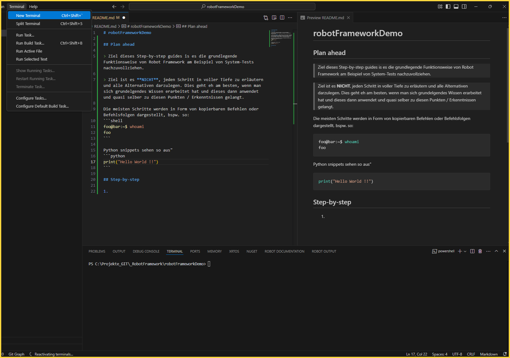
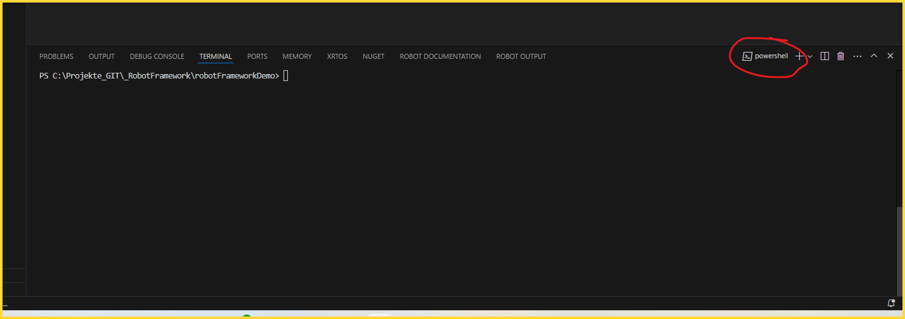
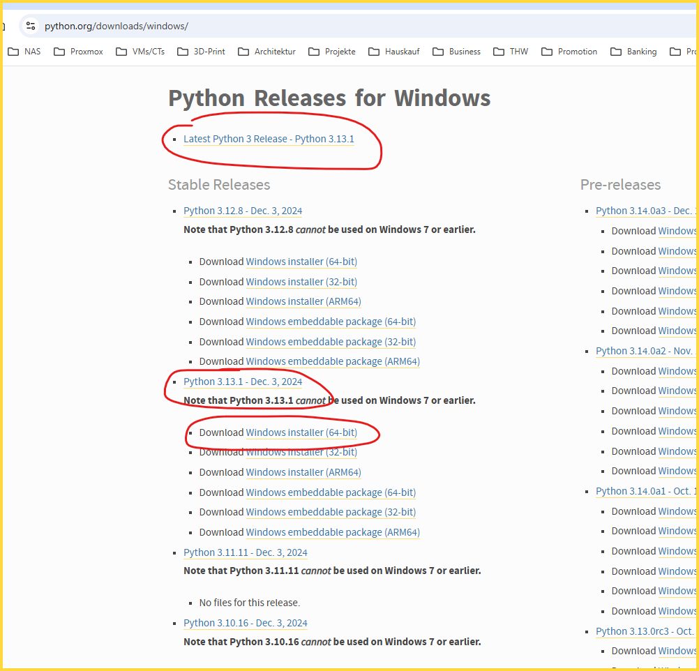
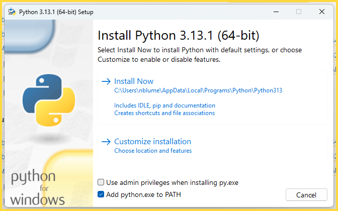
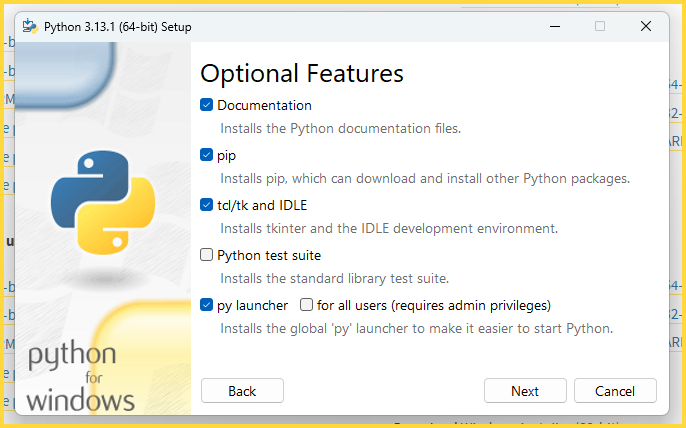
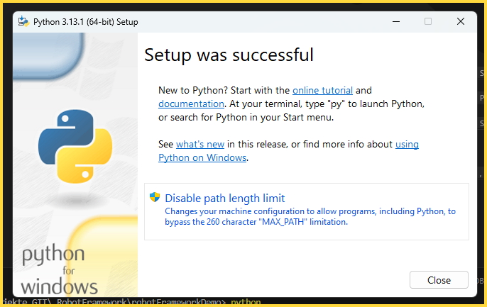
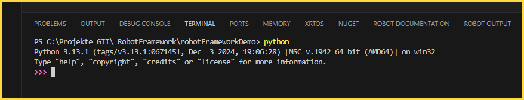

# robotFrameworkDemo

> [!NOTE]
> Ziel dieses Step-by-step guides is es die grundlegende Funktionsweise von Robot Framework am Beispiel von System-Tests nachzuvollziehen.

> [!WARNING]
> Ziel ist es **NICHT**, jeden Schritt in voller Tiefe zu erläutern und alle Alternativen darzulegen. Dies geht eh am besten, wenn man sich grundelgendes Wissen erarbeitet hat und dieses dann anwendet und quasi selber zu diesen Punkten / Erkenntnissen gelangt.

Die meisten Schritte werden in Form von kopierbaren Befehlen oder Befehlsfolgen dargestellt, bspw. so:
```shell
foo@bar:~$ whoami
foo
```
oder in der PowerShell
```PowerShell
get-service | stop-service -whatif
```

Python snippets sehen so aus:
```python
print("Hello World !!")
```

## Step-by-step

1. **In VS Code noch ein Terminal öffnen**

    Dazu im Menü einfach unter Terminal -> New Terminal auswählen.
    

    Als Typ sollte "Power Shell" passen
    

    **Python versuchen zu starten**

    Wenn hier nur der WIndows-Store aufgeht oder nicht sinnvolles passiert, fehlt noch Python...
    ```PowerShell
    python
    ```
    

1. **Python installieren (FALLS noch nicht erfolgt)**

    Da es bei mir noch nicht installiert war, hier die Schritte um Python unter Windows als x64-Version und mit pipenv und allem notwendigen zu installieren..

    Von der Python Homepage den Windfows x64 Installer ind er aktuellsten Version herunterladen (mommentan 3.13.1). Link: https://www.python.org/downloads/windows/ 

    

    Einstellungen

    

    Unter "Customize Installation"

    

    Pfad-Längenbegrenzung ruhig entfernen

   

   Damit das ganze wirksam wird, sollte ein Rechner Neustart erfolgen.
   Dadurch wird die Pfad-Variable vollständig wirksam (evtl. reicht auch Logout, Login).

   Wenn man nun das Kommando im Terminal (PowerShell) wiederholt, dann sollte das ganze so aussehen:

    ```PowerShell
    python
    ```

   

   Zum Verlassen dieses Prompts von Python, muss man die exit Function verwenden.

    ```PowerShell
    exit()
    ```

1. Installation von PIPENV Module für die Erstellung und Handhabung von Virtual Envs

    > [!NOTE]
    > Der Begriff "Virtual Environment" steht als Sinonym für alle möglichen Optionen dafür.
    > 
    > PIPENV nutzt als "Technologie" für die Virtual Environments das Paket "virtualenv", welches auch mit TestStand kompatibel ist (ander als venv). 
    > 
    > Im Folgenden wird die Kurzform "VENV" als allgemeiner Ausdruck für ein Virtual Environment verwendet und nicht gezielt für diese eine Lösung. Sonst ist mir das einfach zu viel Schreibarbeit...

    Bevor nun die notwendigen Pakete für diese Tutorial installiert werden (sollten), muss mindestens die Pakete-Auswahl, die für virtual environments mit pipenv erforerlich ist, installiert werden.

    Mehr zu pipenv unter: 
    - https://pipenv.pypa.io/en/latest/
    - https://docs.python-guide.org/dev/virtualenvs/
    - https://www.computerwoche.de/article/2826406/so-bereinigen-sie-python-projektchaos.html

    > [!CAUTION]
    > Von einem VENV wird stets NUR die Liste der Package (also die Installationsanleitung des VENVs) versioniert, NICHT die eigentliche Installation / das VENV.

    > [!NOTE]
    > Im Falle von PIPENV sind diese Infos in den folgenden Dateien hinterlegt:
    > - Pipfile (Liste der notwendigen Pakete mit Python-Versionsinfo und Quelleninfos für die Pakete)
    > - Pipfile.lock (Liste eines jeden Packages in der verwenden Version samt SHA256-Hash zur Prüfung von Version und Inhalt des Pakets)
    > 
    > Dess Weiteren ist es bei PIPENV (und vermutlich vielen anderen VENV Managern) so, dass in der eigentlichen Installation des VENVs direkt eine passende "gitignore" Datei erzeugt wird, sodass dieser Teil **NICHT** in der Versionierung landet.

    Die Installation von PIPENV (von PyPi) als User-Package erfolgt nun wie folgt:
    ```PowerShell
    pip install --user pipenv
    ```

    ```PowerShell
    PS C:\Projekte_GIT\_RobotFramework\robotFrameworkDemo> pip install --user pipenv                      
    Collecting pipenv
    Downloading pipenv-2024.4.0-py3-none-any.whl.metadata (19 kB)
    Collecting certifi (from pipenv)
    Downloading certifi-2024.12.14-py3-none-any.whl.metadata (2.3 kB)
    Collecting packaging>=22 (from pipenv)
    Downloading packaging-24.2-py3-none-any.whl.metadata (3.2 kB)
    Collecting setuptools>=67 (from pipenv)
    Downloading setuptools-75.6.0-py3-none-any.whl.metadata (6.7 kB)
    Collecting virtualenv>=20.24.2 (from pipenv)
    Downloading virtualenv-20.28.0-py3-none-any.whl.metadata (4.4 kB)
    Collecting distlib<1,>=0.3.7 (from virtualenv>=20.24.2->pipenv)
    Downloading distlib-0.3.9-py2.py3-none-any.whl.metadata (5.2 kB)
    Collecting filelock<4,>=3.12.2 (from virtualenv>=20.24.2->pipenv)
    Downloading filelock-3.16.1-py3-none-any.whl.metadata (2.9 kB)
    Collecting platformdirs<5,>=3.9.1 (from virtualenv>=20.24.2->pipenv)
    Downloading platformdirs-4.3.6-py3-none-any.whl.metadata (11 kB)
    Downloading pipenv-2024.4.0-py3-none-any.whl (3.0 MB)
    ━━━━━━━━━━━━━━━━━━━━━━━━━━━━━━━━━━━━━━━━ 3.0/3.0 MB 12.6 MB/s eta 0:00:00
    Downloading packaging-24.2-py3-none-any.whl (65 kB)
    Downloading setuptools-75.6.0-py3-none-any.whl (1.2 MB)
    ━━━━━━━━━━━━━━━━━━━━━━━━━━━━━━━━━━━━━━━━ 1.2/1.2 MB 12.2 MB/s eta 0:00:00
    Downloading virtualenv-20.28.0-py3-none-any.whl (4.3 MB)
    ━━━━━━━━━━━━━━━━━━━━━━━━━━━━━━━━━━━━━━━━ 4.3/4.3 MB 11.4 MB/s eta 0:00:00
    Downloading certifi-2024.12.14-py3-none-any.whl (164 kB)
    Downloading distlib-0.3.9-py2.py3-none-any.whl (468 kB)
    Downloading filelock-3.16.1-py3-none-any.whl (16 kB)
    Downloading platformdirs-4.3.6-py3-none-any.whl (18 kB)
    Installing collected packages: distlib, setuptools, platformdirs, packaging, filelock, certifi, virtualenv, pipenv
    WARNING: The script virtualenv.exe is installed in 'C:\Users\nblume\AppData\Roaming\Python\Python313\Scripts' which is not on PATH.
    Consider adding this directory to PATH or, if you prefer to suppress this warning, use --no-warn-script-location.
    WARNING: The scripts pipenv-resolver.exe and pipenv.exe are installed in 'C:\Users\nblume\AppData\Roaming\Python\Python313\Scripts' which is not on PATH.
    Consider adding this directory to PATH or, if you prefer to suppress this warning, use --no-warn-script-location.
    Successfully installed certifi-2024.12.14 distlib-0.3.9 filelock-3.16.1 packaging-24.2 pipenv-2024.4.0 platformdirs-4.3.6 setuptools-75.6.0 virtualenv-20.28.0
    PS C:\Projekte_GIT\_RobotFramework\robotFrameworkDemo> 
    ```

    > [!TIP]
    > Den Hinweis am Ende Kann man ruhig beheben. Also einfach der PATH Variable des Users hinzufügen, falls noch nicht erfolgt. Getestet werden kann das ganze gleich mit (Re)Build der PIPENV Umgebung...
    > Vermutlich muss der Pfad bei der System-weiten PATH Variable erg:anzt werden.

1. Recreation of the VENV via PIPENV

    An dieser Stelle soll nun das VENV wieder erzeugt werden, basierend auf dem vorhandenen Pipfile.
    Der Vollständigkeit halber wird im folgenden Punkt noch erläutert, wie man von Grund auf ein VENV mit PIPENV aufsetzen / starten würde.


1. Creation of the VENV via PIPENV

    - Create an pipenv environment
        ```python
        python -m pipenv install
        ```

    - Install packages in the pipenv environment (and add them to the Pipfile for later recreation)
        ```python
        python -m pipenv install "PackageName"
        ```

    - Regularly run the function to update the Pipfile lock
        ```python
        python -m pipenv lock
        ```
    
    - To get list of cmds for pipenv, run:
        ```python
        python -m pipenv
        ```

    - examples are 
        - graph > all dependencies

            ```python
            python -m pipenv graph
            ```

        - requirements to produce a requirements.txt with all packages listed (NOT used for (re)creation of virtualenv)

            ```python
            python -m pipenv requirements
            ```
    